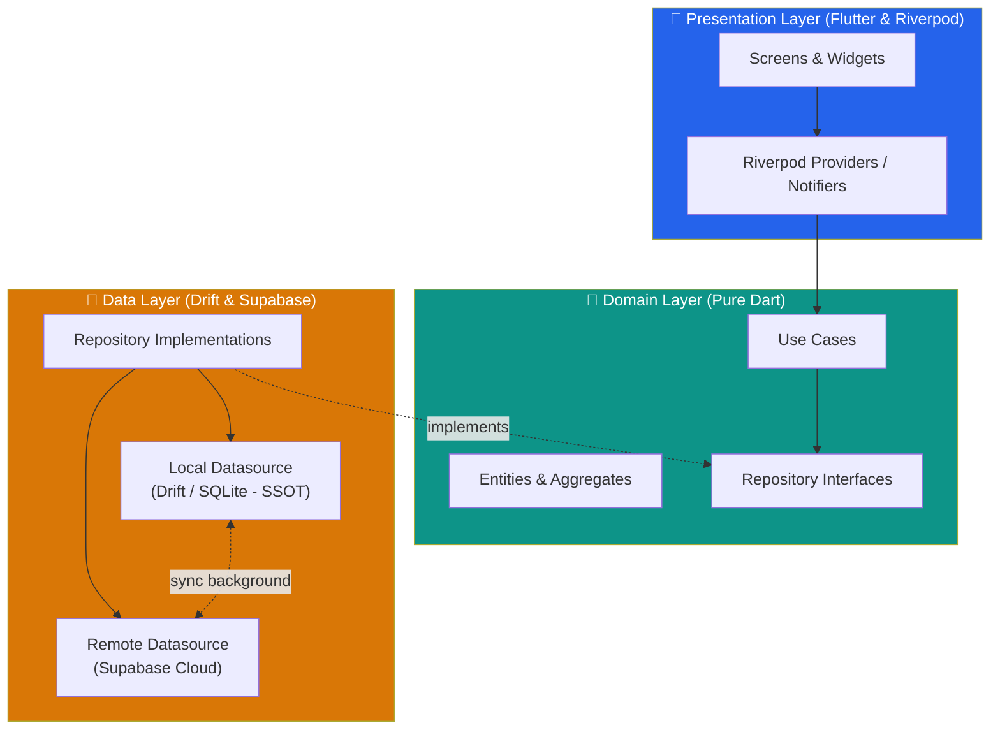
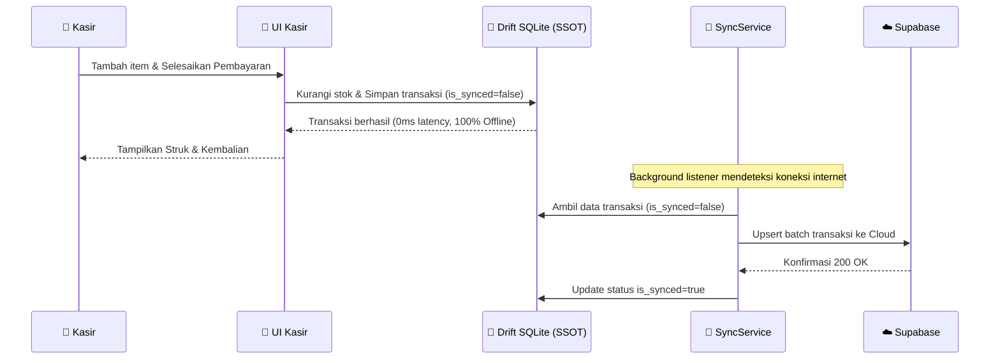

# ☕📦 UMKM POS — Flutter Edition

[](https://flutter.dev)
[](https://dart.dev)
[](https://riverpod.dev)
[-00599C)](https://drift.simonbinder.eu)
[](https://github.com/RulyOctareza/UMKM-Pos-Flutter)
[](https://opensource.org/licenses/MIT)

> **Aplikasi Kasir (Point of Sale) Offline-First modern & tangguh untuk UMKM Indonesia.**
> Dibangun dengan **Flutter**, **Clean Architecture (Feature-First)**, **Riverpod**, dan **Drift (SQLite)**. Satu codebase yang responsif penuh untuk ponsel dan tablet (portrait & landscape).

---

## 🌟 Fitur Utama

| Fitur | Deskripsi |
|---|---|
| ⚡ **Kasir Cepat & Ergonomis** | Katalog grid responsif, tap untuk tambah pesanan, tombol minus (-) ekstra besar ($40\times40\text{ dp}$) di pojok kiri atas kartu untuk kurangi/hapus item seketika. |
| 📴 **100% Offline-First SSOT** | Transaksi, mutasi stok atomik, dan kalkulasi kembalian tersimpan langsung di SQLite lokal (Drift) tanpa bergantung koneksi internet. |
| 🔄 **Background Sync** | Sinkronisasi dua arah otomatis ke backend Supabase saat perangkat kembali terhubung online. |
| 📋 **Katalog Produk Fleksibel** | Tampilan default **List View** informatif dengan opsi switcher **Grid View**, lengkap dengan status stok tipis & habis. |
| 💳 **Multi Metode Pembayaran** | Pembayaran Tunai dengan Numpad hitung kembalian instan, QRIS Statis/Dinamis, dan Transfer Bank. |
| 🧾 **Struk Digital & PDF** | Bagikan struk instan via WhatsApp/teks dan cetak bukti pembayaran PDF. |
| 📊 **Dashboard & Laporan Penjualan** | Omzet hari ini, grafik transaksi bulanan, rata-rata keranjang (AOV), dan daftar produk terlaris. |
| ⚡ **Demo Data Seeder Instan** | 1-tap "Muat Data Demo UMKM" (Coffee Shop & Bakery) dengan foto produk HD dari Unsplash CDN. |
| 🌓 **Adaptive Light/Dark Theme** | Default **Light Mode** elegan dengan palet warna kontras tinggi, ramah di mata kasir. |

---

## 🏗️ Arsitektur Sistem

Proyek ini menerapkan **Clean Architecture** dengan pendekatan **Feature-First**:



### 🔄 Alur Data Offline-First:



---

## 📐 Tata Letak Responsif (Adaptive Layout)

Tidak ada *hardcoded breakpoint*. Aplikasi secara dinamis menyesuaikan struktur antarmuka berdasarkan ruang layar yang tersedia:

| Perangkat / Ukuran | Navigasi | Halaman Kasir |
|---|---|---|
| 📱 **Smartphone (Compact)** | Bottom `NavigationBar` | Grid katalog produk full-width + Floating Bar Keranjang & Modal Bottom Sheet |
| 💻 **Tablet / Desktop (Expanded)** | Left `NavigationRail` | Grid produk (kiri) + Panel Keranjang Permanen (*Side-by-side*) |

---

## 🛠️ Tech Stack & Pustaka Utama

- **Framework**: [Flutter](https://flutter.dev) (Dart 3)
- **State Management**: [Flutter Riverpod](https://riverpod.dev)
- **Database Lokal**: [Drift (SQLite)](https://drift.simonbinder.eu) dengan SQLite FFI & reactive streams
- **Backend & Cloud Sync**: [Supabase Flutter](https://supabase.com)
- **Navigasi & Routing**: [GoRouter](https://pub.dev/packages/go_router)
- **Format Mata Uang & Tanggal**: `intl` (Lokalisasi Rupiah `id_ID`)
- **Image Caching**: `cached_network_image`
- **PDF & Struk**: `pdf` & `printing`
- **Ikonografi & Desain**: Phosphor Icons & Google Fonts (`Outfit` & `Inter`)

---

## 🚀 Memulai Proyek (Getting Started)

### Prasyarat:
- Flutter SDK $\ge 3.22.0$
- Dart SDK $\ge 3.4.0$

### Langkah Instalasi:

1. **Clone repository**:
   ```bash
   git clone https://github.com/RulyOctareza/UMKM-Pos-Flutter.git
   cd UMKM-Pos-Flutter
   ```

2. **Unduh dependencies**:
   ```bash
   flutter pub get
   ```

3. **Generate kode Drift & Riverpod** *(jika ada perubahan skema database)*:
   ```bash
   dart run build_runner build --delete-conflicting-outputs
   ```

4. **Jalankan aplikasi**:
   ```bash
   flutter run
   ```

---

## 🧪 Pengujian Otomatis (Testing)

Proyek ini dilengkapi dengan rangkaian test komprehensif (Unit Test, SQLite Drift in-memory test, UseCase test, Aggregate test, dan Widget test):

```bash
# Menjalankan static analyzer
flutter analyze

# Menjalankan seluruh test suite
flutter test --coverage
```

### Hasil Test:
```text
00:07 +28: All tests passed! (28/28 tests passing - 100%)
```

---

## 📂 Struktur Folder Proyek

```text
lib/
├── app/                  # Inisialisasi Aplikasi, Router, Tema & Design Tokens
│   ├── router.dart
│   └── theme/
├── core/                 # Shared Components, Utilities, Database Drift & Services
│   ├── database/         # Tabel Drift, In-Memory DB, & Data Seeder
│   ├── errors/           # Failure & Result Pattern
│   ├── services/         # Receipt & PDF Generation
│   ├── sync/             # Supabase Offline Sync Engine
│   ├── utils/            # Currency & Date Formatters
│   └── widgets/          # ProductCard, Numpad, AppButtons, Badges
└── features/             # Feature-First Architecture
    ├── auth/             # Onboarding & Setup Profil Toko
    ├── cart/             # State Keranjang Belanja
    ├── dashboard/        # Laporan Penjualan & Produk Terlaris
    ├── products/         # CRUD Produk, Kategori, & Manajemen Stok
    ├── settings/         # Pengaturan Toko, Tema, & Demo Seeder
    └── transactions/     # Kasir POS, Pembayaran, Riwayat, & Detail Transaksi
```

---

## 📄 Lisensi

Didistribusikan di bawah lisensi MIT. Lihat `LICENSE` untuk informasi lebih lanjut.

---

<p align="center">
  Dibuat dengan ❤️ untuk kemajuan UMKM Indonesia 🇮🇩
</p>
