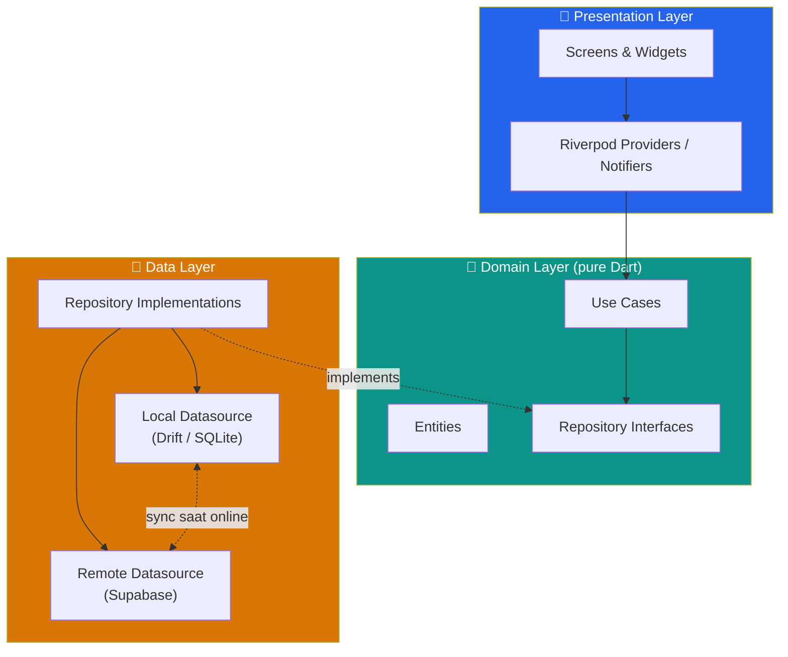
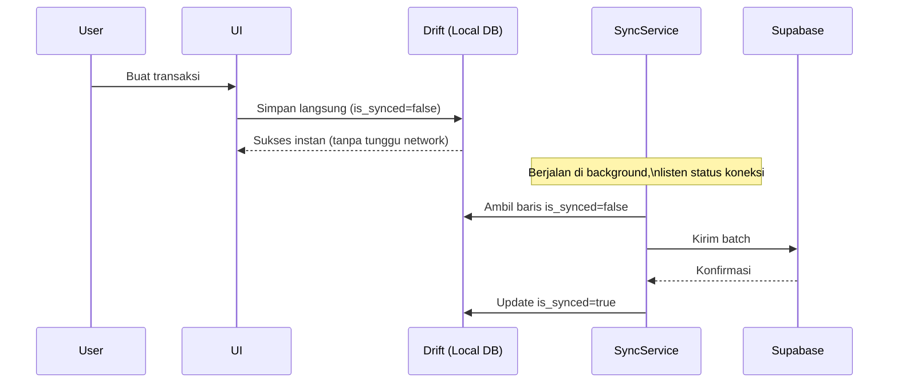

# UMKM POS — Flutter Edition

> Aplikasi kasir (POS) offline-first untuk UMKM Indonesia — dibangun dengan Flutter, Riverpod, dan Drift. Satu codebase, responsive penuh untuk phone & tablet, portrait & landscape.

<!--
  TODO sebelum publish:
  - Ganti placeholder di bawah dengan screenshot/GIF asli hasil demo aplikasi
  - Tempat yang direkomendasikan: halaman Kasir (portrait & landscape), animasi tap-produk-ke-cart, checkout flow, dashboard
-->

<p align="center">
  
  
</p>

<p align="center">
  
</p>

## ✨ Fitur Utama

- 🧾 **Kasir cepat** — pilih produk, hitung otomatis, kembalian tunai instan
- 📴 **Offline-first sepenuhnya** — semua fitur inti jalan tanpa internet, sinkron otomatis saat online kembali
- 📊 **Dashboard ringkas** — penjualan harian, produk terlaris
- 📦 **Manajemen produk & stok** — CRUD produk, notifikasi stok menipis
- 🧾 **Riwayat transaksi** — cari & filter transaksi
- 📱📲 **Responsive penuh** — satu codebase untuk phone & tablet, portrait & landscape, tanpa breakpoint hardcode

## 🏗️ Arsitektur

Clean Architecture (data / domain / presentation) dengan struktur **feature-first**, state management **Riverpod**, database lokal **Drift (SQLite)**, backend **Supabase**.



**Alur data sinkronisasi (offline-first):**



📄 Detail lengkap: [`docs/ARCHITECTURE.md`](docs/ARCHITECTURE.md)

## 🎯 Keputusan Teknis Penting (ringkas — alasan lengkap ada di docs)

| Keputusan | Kenapa (ringkas) | Detail |
|---|---|---|
| **Riverpod**, bukan GetX/Bloc | Compile-safe, testable tanpa `BuildContext`, standar modern | [ARCHITECTURE.md §3](docs/ARCHITECTURE.md#3-state-management-riverpod-bukan-getxbloc-provider-polos) |
| **Drift**, bukan Hive/Isar | POS butuh query relasional (join, agregasi laporan) — Drift = SQLite type-safe, Hive cuma key-value | [ARCHITECTURE.md §4](docs/ARCHITECTURE.md#4-local-database-drift-bukan-hiveisar) |
| **Clean Architecture + Feature-first** | Domain layer murni Dart → testable, mudah navigasi kode saat fitur bertambah | [ARCHITECTURE.md §1](docs/ARCHITECTURE.md#1-pattern-utama-clean-architecture--feature-first) |
| **Native `Flex`/`Expanded`**, bukan package adaptive pihak ketiga | Menunjukkan pemahaman fundamental layout Flutter, bukan hanya konsumsi package | [DESIGN_SYSTEM.md §6](docs/DESIGN_SYSTEM.md#6-responsive-design--aturan-wajib) |
| **Phosphor Icons**, bukan Material default polos | Personality visual, koleksi lebih relevan untuk konteks retail | [DESIGN_SYSTEM.md §8](docs/DESIGN_SYSTEM.md#8-icons--custom-icon-package-bukan-icons-material-default-polos) |

## 📱 Responsive Design

Satu codebase, adaptif penuh:

| | Compact (phone portrait) | Expanded (tablet landscape) |
|---|---|---|
| Navigasi | Bottom `NavigationBar` | Kiri `NavigationRail` |
| Halaman Kasir | Grid produk full-width, keranjang = bottom sheet | Grid produk + panel keranjang permanen side-by-side |
| Grid produk | Kolom otomatis via `SliverGridDelegateWithMaxCrossAxisExtent` (tidak pernah hardcode jumlah kolom) |

## 🧪 Testing

- Unit test (domain & data layer) — target coverage > 80%
- Widget test — semua screen utama
- Golden test — 4 kombinasi device (phone/tablet × portrait/landscape)
- Integration test — 3 flow kritikal (transaksi, offline→sync, tambah produk)

📄 Detail: [`docs/TESTING.md`](docs/TESTING.md)

## 📂 Struktur Dokumentasi Proyek

```
docs/
├── PRD.md                   # Product Requirements — scope, user flow, requirement
├── ARCHITECTURE.md          # Design pattern, folder structure, strategi sync
├── DESIGN_SYSTEM.md         # Design tokens, komponen, responsive rules, ikon, animasi
├── TESTING.md               # Strategi testing per layer
└── DEVELOPMENT_PROCESS.md   # Log keputusan & alasan (living document)
```

Dokumen-dokumen ini ditulis agar bisa dibaca dan dipahami langsung oleh AI coding assistant (mis. Claude Code) untuk melanjutkan implementasi secara konsisten dengan keputusan yang sudah diambil.

## 🚀 Getting Started

```bash
flutter pub get
dart run build_runner build --delete-conflicting-outputs   # generate Riverpod & Drift code
flutter run
```

## 🛠️ Tech Stack

Flutter · Riverpod · Drift (SQLite) · Supabase · go_router · Phosphor Icons · Google Fonts

## 📄 Lisensi

MIT
