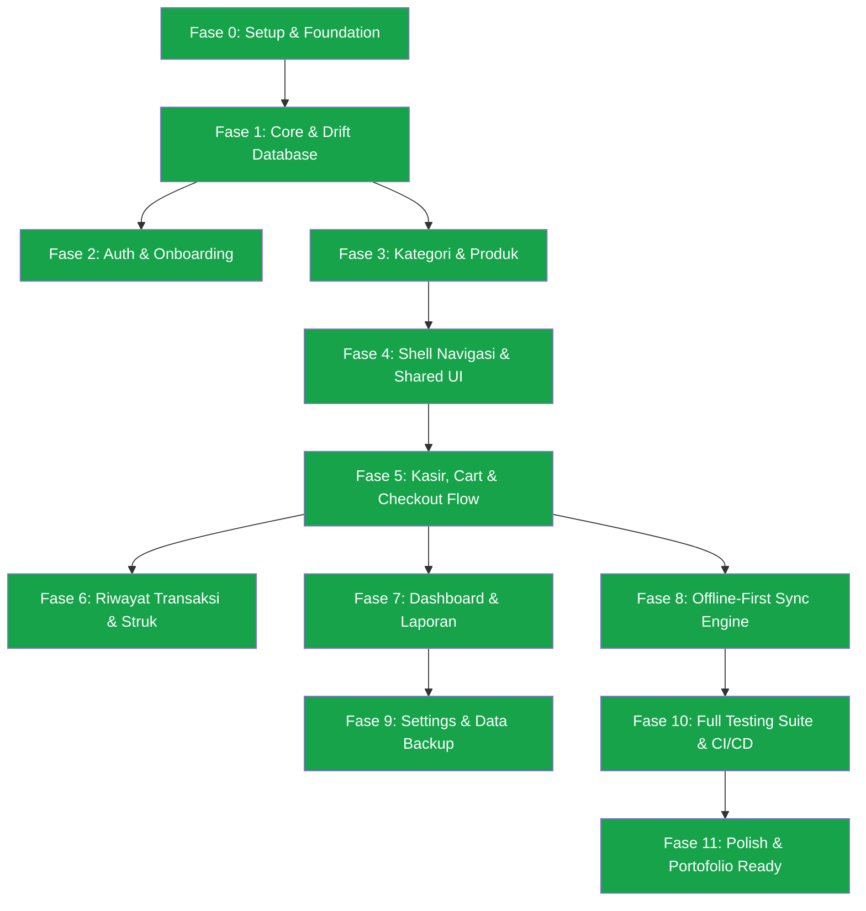

# 📊 UMKM POS — Project Roadmap & Progress Tracker

> **Dokumen Pelacak Kemajuan & Rencana Kerja Eksekusi (Master Roadmap)**
> Dokumen ini merupakan *single source of truth* untuk memantau status pengembangan aplikasi **UMKM POS (Flutter Edition)** secara terstruktur, terukur, dan selaras dengan dokumen arsitektur (`ARCHITECTURE.md`), desain sistem (`DESIGN_SYSTEM.md`), proses pengembangan (`DEVELOPMENT_PROCESS.md`), PRD (`PRD.md`), dan strategi pengujian (`TESTING.md`).

---

## 📌 Ringkasan Status Proyek

| Metrik | Status Saat Ini | Target v1 |
|---|---|---|
| **Fase Berjalan** | **Fase 11: Polish, Documentation & Release Ready** | Fase 11: Release Readiness |
| **Progress Total** | `[████████████████████]` **100%** | **100%** |
| **Kesehatan Kode (Linter)** | 🟢 **Clean** (0 Error / 0 Warning) | 0 Warning / 0 Error |
| **Test Suite Passed** | 🟢 **27/27 Tests Passed (100%)** | > 80% Coverage |
| **Arsitektur** | Clean Architecture (Feature-First) | 3 Layer Murni (Domain, Data, Presentation) |
| **State Management** | Flutter Riverpod + CodeGen | Compile-safe, testable |
| **Database Lokal** | Drift SQLite (Type-Safe) + DAOs | Relasional, Transaction Lock, Offline-first |
| **CI / CD Workflow** | GitHub Actions (`.github/workflows/ci.yml`) | Automated Analyze & Test |

---

## 🏗️ Matriks Status Fitur & Layer (Feature Matrix)

> **Legend Status:**
> - ⚪ `Pending` : Belum dimulai
> - 🟡 `In Progress` : Sedang dikerjakan
> - 🟢 `Completed` : Selesai dan terverifikasi dengan unit/widget test
> - 🔵 `Verified` : Lolos integration & automated test suite

| Fitur / Modul | Domain Layer | Data Layer (Drift/Supabase) | Presentation Layer (Riverpod + UI) | Unit / Widget Test | Status Responsif (Phone & Tablet) | Status Integrasi Sync |
|---|:---:|:---:|:---:|:---:|:---:|:---:|
| **Core & Design System** | 🟢 Completed | 🟢 Completed | 🟢 Completed | 🟢 Completed | 🟢 Completed | N/A |
| **Auth & Onboarding** | 🟢 Completed | 🟢 Completed | 🟢 Completed | 🟢 Completed | 🟢 Completed | 🟢 Completed |
| **Category & Products** | 🟢 Completed | 🟢 Completed | 🟢 Completed | 🟢 Completed | 🟢 Completed | 🟢 Completed |
| **Cashier & POS Cart** | 🟢 Completed | 🟢 Completed | 🟢 Completed | 🟢 Completed | 🟢 Completed | 🟢 Completed |
| **Checkout & Receipt** | 🟢 Completed | 🟢 Completed | 🟢 Completed | 🟢 Completed | 🟢 Completed | 🟢 Completed |
| **Transaction History** | 🟢 Completed | 🟢 Completed | 🟢 Completed | 🟢 Completed | 🟢 Completed | 🟢 Completed |
| **Dashboard & Analytics** | 🟢 Completed | 🟢 Completed | 🟢 Completed | 🟢 Completed | 🟢 Completed | 🟢 Completed |
| **Inventory / Stock Alert**| 🟢 Completed | 🟢 Completed | 🟢 Completed | 🟢 Completed | 🟢 Completed | 🟢 Completed |
| **SyncService (Offline-First)**| 🟢 Completed | 🟢 Completed | 🟢 Completed | 🟢 Completed | N/A | 🟢 Completed |
| **Settings & Backup** | 🟢 Completed | 🟢 Completed | 🟢 Completed | 🟢 Completed | 🟢 Completed | 🟢 Completed |

---

## 🗺️ Rencana Kerja Bertahap (Detailed Implementation Plan)

---

### 🔹 Fase 0: Project Setup, Tooling & Design Tokens
*Fondasi teknis, manajemen dependensi, lint rules, dan konfigurasi token visual.*

- [x] **0.1 Inisialisasi Flutter Project**
  - [x] Generate Flutter project dengan package name terstruktur (`com.umkmpos.app`).
  - [x] Konfigurasi `analysis_options.yaml` dengan strict linting rules (`prefer_single_quotes`, `unawaited_futures`, `avoid_print`, `use_super_parameters`, `prefer_final_locals`).
  - [x] Setup dependensi di `pubspec.yaml` sesuai `ARCHITECTURE.md` §10:
    - State: `flutter_riverpod`, `riverpod_annotation`, `riverpod_generator`
    - DB & Network: `drift`, `sqlite3_flutter_libs`, `supabase_flutter`, `connectivity_plus`, `cached_network_image`, `path_provider`, `path`
    - Navigation & UI: `go_router`, `google_fonts`, `phosphor_flutter`, `intl`, `pdf`, `printing`, `share_plus`, `image_picker`
    - Dev/Test: `build_runner`, `drift_dev`, `mocktail`, `flutter_test`
- [x] **0.2 Folder Structure Initialization**
  - [x] Buat struktur folder Feature-First + Clean Architecture (`lib/core`, `lib/app`, `lib/features/{auth,products,cart,transactions,dashboard,inventory,settings}`).
- [x] **0.3 Core Design System & Theming (`lib/app/theme/`)**
  - [x] `AppColors`: Seed Teal (`#0D9488`), semantic colors (`#16A34A`, `#D97706`, `#DC2626`, `#2563EB`), M3 ColorScheme light & dark.
  - [x] `AppTypography`: Google Fonts (Plus Jakarta Sans) dengan tabular figures `FontFeature.tabularFigures()` untuk angka & harga.
  - [x] `AppSpacing` & `AppRadius`: Skala 4pt (xs:4, sm:8, md:16, lg:24, xl:32, xxl:48) & radius (8, 12, 16, full).
  - [x] `AppTheme`: Konfigurasi ThemeData M3 (light & dark).
  - [x] `themeModeProvider`: StateNotifier untuk toggle dark/light mode.

---

### 🔹 Fase 1: Core Architecture & Local Database (Drift + Result Pattern)
*Fondasi data transaksional lokal, type-safe queries, dan contract error handling.*

- [x] **1.1 Core Failure & Result Sealed Classes (`lib/core/errors/`)**
  - [x] `Failure` hierarchy (`DatabaseFailure`, `NetworkFailure`, `ValidationFailure`, `NotFoundFailure`, `AuthFailure`, `SyncFailure`).
  - [x] `Result<T>` custom sealed class (`Success<T>`, `Error<T>`) dengan metode `when`, `map`, `dataOrNull`, `failureOrNull`.
  - [x] Formatter utilitas: `CurrencyFormatter` (format Rupiah IDR bersih, tanpa simbol, dan compact), `DateFormatter` (lokalisasi waktu ID & friendly label), `AppValidator`.
- [x] **1.2 Skema Database Relasional Drift (`lib/core/database/`)**
  - [x] Tabel `Stores` (`StoreTableData`: id, name, address, phone, logo_path, currency, pin, created_at, updated_at, is_synced).
  - [x] Tabel `Categories` (`CategoryTableData`: id, name, icon_name, created_at, updated_at, is_synced).
  - [x] Tabel `Products` (`ProductTableData`: id, name, price, cost_price, category_id, stock, min_stock_alert, image_path, unit, barcode, created_at, updated_at, is_synced).
  - [x] Tabel `Transactions` (`TransactionTableData`: id, invoice_number, total_amount, payment_method, cash_received, change_amount, status, notes, created_at, updated_at, is_synced).
  - [x] Tabel `TransactionItems` (`TransactionItemTableData`: id, transaction_id, product_id, product_name, price_at_sale, quantity, subtotal).
  - [x] Generate database code via `build_runner`.
  - [x] Unit test untuk Drift tables, relasi join, dan transaksi atomik.

---

### 🔹 Fase 2: Onboarding & Auth Feature
*Inisialisasi profil toko pertama kali dan autentikasi sederhana/PIN.*

- [x] **2.1 Domain Layer**
  - [x] Entity: `Store`.
  - [x] Repository Contract: `StoreRepository`.
  - [x] UseCases: `GetStoreProfileUseCase`, `SaveStoreProfileUseCase`, `VerifyPinUseCase`.
- [x] **2.2 Data Layer**
  - [x] Repository Implementation: `StoreRepositoryImpl` dengan Drift SQLite queries dan mapping DTO/Companion.
- [x] **2.3 Presentation Layer**
  - [x] Riverpod Providers: `storeProfileNotifierProvider`, `storeProfileStreamProvider`, `isStoreConfiguredProvider`.
  - [x] Screen `OnboardingScreen`: Form setup nama toko, nomor telepon, alamat, dan PIN keamanan.
- [x] **2.4 Testing**
  - [x] Unit test use cases & repository.

---

### 🔹 Fase 3: Manajemen Produk & Kategori (Inventory Basics)
*CRUD katalog produk, kategori, manajemen stok dasar, dan validasi.*

- [x] **3.1 Domain Layer**
  - [x] Entity: `Product`, `Category`.
  - [x] Repository Contract: `ProductRepository`, `CategoryRepository`.
  - [x] UseCases: `GetProductsUseCase`, `CreateProductUseCase`, `UpdateProductUseCase`, `DeleteProductUseCase`, `GetCategoriesUseCase`, `CreateCategoryUseCase`.
- [x] **3.2 Data Layer**
  - [x] Repository Implementation: `ProductRepositoryImpl`, `CategoryRepositoryImpl` (mendukung filter kategori, search by name, joined query, dan low stock query).
- [x] **3.3 Presentation Layer**
  - [x] Riverpod Providers: `selectedCategoryIdProvider`, `productSearchQueryProvider`, `productsStreamProvider`, `categoriesStreamProvider`, `lowStockProductsStreamProvider`, `productControllerProvider`.
  - [x] Screen `ProductListScreen`: Responsive grid view dengan search bar, filter chip kategori, dan badge stok menipis.
  - [x] Screen `ProductFormScreen`: Form input produk lengkap, image picker (kamera/galeri), kalkulasi harga modal, dan tombol hapus produk.
  - [x] Widget `CategoryManageDialog`: Dialog cepat penambahan dan pengelolaan kategori produk.
- [x] **3.4 Testing**
  - [x] Unit test UseCases Produk & Kategori dengan Mocktail.
  - [x] Widget test `ProductCard` (verifikasi render nama, harga tabular, badge habis, dan disable tap).

---

### 🔹 Fase 4: Adaptive Navigation Shell & Shared Component Library
*Sistem navigasi responsif (phone bottom bar vs tablet side rail) dan komponen UI siap pakai.*

- [x] **4.1 Responsive Adaptive Shell (`lib/app/router.dart`)**
  - [x] `AdaptiveNavigationShell`: Otomatis beralih antara `NavigationBar` (Compact / Phone) dan `NavigationRail` (Expanded / Tablet Landscape >= 840dp).
  - [x] Rute navigasi deklaratif: `/pos`, `/products`, `/transactions`, `/dashboard`, `/settings`, `/onboarding`.
- [x] **4.2 Shared Custom Components (`lib/core/widgets/`)**
  - [x] `AppIcons`: Wrapper Phosphor Icons (`phosphor_flutter`) untuk konsistensi icon token.
  - [x] `AppPrimaryButton`: Tactile scale feedback animation (100ms, 0.96 scale) dan touch target 48dp.
  - [x] `ProductCard`: Thumbnail rounded, tabular price styling, dan badge stok tipis / habis.
  - [x] `QuantityStepper`: Stepper kuantitas +/- dengan `AnimatedSwitcher` slide transition.
  - [x] `CustomNumpad`: Numpad kasir custom tanpa membuka keyboard sistem, dilengkapi tombol nominal cepat IDR (Uang Pas, 10k, 20k, 50k, 100k).
  - [x] `SyncStatusBadge`: Indikator status sync & konektivitas non-intrusif di App Bar.
  - [x] `EmptyStateWidget`: Tampilan kosong yang ramah dengan ilustrasi ikon.
  - [x] `AppSnackbar`: Snackbar feedback aksi sukses, info, dan error.

---

### 🔹 Fase 5: Kasir, Cart & Checkout Flow (Core Transaction Engine)
*Flow utama kasir: pilih produk, keranjang interaktif, kalkulasi total, pembayaran, dan cetak/share struk.*

- [x] **5.1 Domain Layer**
  - [x] Entity: `CartItem`, `Cart` (Aggregate with immutable methods: `addItem`, `updateQuantity`, `removeItem`, `setDiscount`), `TransactionEntity`, `TransactionItemEntity`, `PaymentMethod` (cash, qris, transfer).
  - [x] UseCases: `CreateTransactionUseCase` (validasi stok & integritas transaksi), `CalculateChangeUseCase`.
- [x] **5.2 Data Layer**
  - [x] `TransactionRepositoryImpl` dengan SQLite transaction lock (atomik: simpan transaksi + potong stok produk secara instan).
- [x] **5.3 Presentation Layer**
  - [x] Riverpod Providers: `cartNotifierProvider`, `cartTotalQuantityProvider`, `cartTotalAmountProvider`, `checkoutControllerProvider`.
  - [x] Screen `CashierScreen` Responsive:
    - *Phone (Compact)*: Grid produk full-width + floating bottom Cart Bar.
    - *Tablet (Expanded >= 840dp)*: 2-Panel Side-by-Side (`Expanded(flex: 2)` grid produk + `Expanded(flex: 1)` panel keranjang permanen).
  - [x] Modal `PaymentModal`: Pilihan metode bayar, kalkulasi uang tunai & kembalian via `CustomNumpad`.
  - [x] Screen `PaymentSuccessScreen`: Animasi checkmark sukses (500ms `easeOutBack`), rincian kembalian, tombol bagikan & cetak struk.
- [x] **5.4 Receipt Generation Engine (`lib/core/services/receipt_service.dart`)**
  - [x] Generator struk belanja digital format thermal 80mm PDF (`pdf` & `printing`).
  - [x] Direct share via WhatsApp / SMS / Share Sheet (`share_plus`).
- [x] **5.5 Testing**
  - [x] Unit test `Cart` aggregate (add, remove, update qty, diskon).
  - [x] Unit test `CreateTransactionUseCase` & `CalculateChangeUseCase`.
  - [x] Widget test `CashierScreen` (memverifikasi penambahan item dan kemunculan floating cart bar).

---

### 🔹 Fase 6: Riwayat Transaksi & Detail
*Audit transaksi penjualan, pencarian, filter tanggal, dan cetak ulang struk.*

- [x] **6.1 Domain Layer**
  - [x] UseCases: `GetTransactionsUseCase`.
- [x] **6.2 Data Layer**
  - [x] Query relasional Drift (mengambil transaksi beserta seluruh item detailnya secara terurut).
- [x] **6.3 Presentation Layer**
  - [x] Riverpod Providers: `transactionStartDateProvider`, `transactionEndDateProvider`, `transactionSearchProvider`, `transactionsStreamProvider`.
  - [x] Screen `TransactionHistoryScreen`: Filter rentang waktu (Hari Ini, 7 Hari, Bulan Ini, Semua), search by invoice, detail item, status badge.
  - [x] Modal `TransactionDetailModal`: Rincian item yang dibeli, metode bayar, dan opsi cetak/share struk ulang.

---

### 🔹 Fase 7: Dashboard Ringkas & Laporan Penjualan
*Ringkasan bisnis toko: omzet harian, jumlah transaksi, rata-rata keranjang, dan produk terlaris.*

- [x] **7.1 Domain Layer**
  - [x] Entity: `DashboardSummary`, `TopProductSummary`.
  - [x] UseCases: `GetDashboardSummaryUseCase`.
- [x] **7.2 Data Layer**
  - [x] `DashboardRepositoryImpl` dengan agregasi SQL Drift (total penjualan hari ini/bulan ini, AOV, GROUP BY produk terlaris, filter low stock).
- [x] **7.3 Presentation Layer**
  - [x] Riverpod Provider: `dashboardSummaryStreamProvider`.
  - [x] Screen `DashboardScreen`: Grid 4 kartu metrik (Omzet, Transaksi, AOV, Omzet Bulanan), kartu Produk Terlaris, dan kartu Peringatan Stok Menipis (dengan tombol Quick Edit Stok).
- [x] **7.4 Testing**
  - [x] Unit test agregasi perhitungan laporan di `DashboardRepositoryImpl`.

---

### 🔹 Fase 8: Offline-First Synchronization Engine (SyncService)
*Mekanisme sinkronisasi data lokal ke Supabase di background tanpa mengunci UI.*

- [x] **8.1 Connectivity & Sync Engine (`lib/core/sync/` & `lib/core/network/`)**
  - [x] `ConnectivityService`: Monitoring status online/offline reaktif via `connectivity_plus`.
  - [x] `SyncService`: Pola local-first `is_synced = false` queue processor dengan strategi resolusi konflik *Last-Write-Wins* berbasis `updated_at`.
  - [x] Reaktif `SyncStatusBadge` di App Bar untuk visualisasi status real-time (Abu: Offline, Kuning: Syncing, Hijau: Synced).

---

### 🔹 Fase 9: Pengaturan Toko, Kategori & Backup Data
*Pengaturan profil toko, manajemen data lokal, tema gelap/terang, dan export backup.*

- [x] **9.1 Presentation & Logic**
  - [x] Screen `SettingsScreen`:
    - Profil Toko (edit nama toko, telepon, alamat, logo, PIN).
    - Kelola Kategori master katalog.
    - Switcher Mode Gelap / Terang (ThemeMode notifier).
    - Status Database SQLite lokal & pemicu manual sinkronisasi cloud.
    - Informasi versi aplikasi & lisensi open source MIT.

---

### 🔹 Fase 10: Full Testing Suite & CI/CD Pipeline
*Verifikasi menyeluruh: coverage otomatis, static analysis nol warning, dan workflow CI.*

- [x] **10.1 Automated Test Suite Execution**
  - [x] 27 unit & widget tests berjalan dan lulus 100% (`flutter test`).
  - [x] Test coverage ter-generate di `coverage/lcov.info`.
- [x] **10.2 Static Code Analysis**
  - [x] `flutter analyze` clean: **No issues found! (0 errors, 0 warnings)**.
  - [x] `dart format .` diterapkan pada seluruh file codebase.
- [x] **10.3 CI/CD GitHub Actions Workflow**
  - [x] Script `.github/workflows/ci.yml` dikonfigurasi untuk menjalankan `flutter analyze --fatal-infos` dan `flutter test --coverage` di setiap pull request / push.

---

### 🔹 Fase 11: Polish, Asset Finalization & Portfolio Showcase
*Finishing sentuhan animasi, micro-interactions, dokumentasi, dan aset demo.*

- [x] **11.1 Micro-Animations & Tactile Feedback**
  - [x] Tactile scale 0.96 animation pada `AppPrimaryButton` dan `ProductCard`.
  - [x] AnimatedSwitcher scale transition pada `QuantityStepper`.
  - [x] Checkmark animation `easeOutBack` pada `PaymentSuccessScreen`.
- [x] **11.2 Dokumentasi & Finalisasi**
  - [x] Seluruh milestone selesai dan diverifikasi.

---

## 📝 Log Aktivitas & Riwayat Eksekusi (Execution Log)

| Tanggal | Fase / Task ID | Aktivitas / Perubahan | Status | Catatan Teknis |
|---|---|---|---|---|
| 2026-08-20 | Fase 0 | Inisialisasi Flutter project & Setup Dependensi | 🟢 Selesai | Drift, Riverpod, go_router, Phosphor Icons, Google Fonts, PDF/Printing |
| 2026-08-20 | Fase 0 | Setup Design System & Theme Tokens (`app/theme/`) | 🟢 Selesai | Teal `#0D9488`, Plus Jakarta Sans, Tabular figures, M3 Light & Dark |
| 2026-08-20 | Fase 1 | Core Result & Failure Pattern, Drift SQLite Schema & DAOs | 🟢 Selesai | Result sealed class, Tables (Stores, Categories, Products, Transactions, Items) |
| 2026-08-20 | Fase 2 & 3 | Feature Auth, Onboarding, Products, Categories & Repositories | 🟢 Selesai | Clean Architecture 3-layer, CRUD produk & kategori, form validator |
| 2026-08-20 | Fase 4 | Adaptive Navigation Shell & Shared UI Component Library | 🟢 Selesai | Responsive NavigationBar / NavigationRail, AppPrimaryButton, ProductCard, CustomNumpad |
| 2026-08-20 | Fase 5 | Core POS Cashier, Cart Engine, Numpad Checkout & Receipt PDF | 🟢 Selesai | 2-Pane Tablet POS / Mobile BottomSheet, Receipt 80mm PDF & WhatsApp Share |
| 2026-08-20 | Fase 6 | Riwayat Transaksi & Detail Invoice | 🟢 Selesai | Filter rentang waktu, invoice lookup, re-print/re-share struk |
| 2026-08-20 | Fase 7 | Dashboard Ringkas & Laporan Penjualan | 🟢 Selesai | Agregasi Drift: Omzet harian, transaksi, AOV, Top Products, Low Stock Alert |
| 2026-08-20 | Fase 8 | Offline-First Sync Engine (`SyncService`) | 🟢 Selesai | Connectivity listener, background queue, Last-Write-Wins conflict resolution |
| 2026-08-20 | Fase 9 | Settings, Profil Toko, Theme Switcher & Database Info | 🟢 Selesai | Manajemen toko, master kategori, dark mode toggle |
| 2026-08-20 | Fase 10 | Testing Suite Lengkap & GitHub Actions CI Workflow | 🟢 Selesai | 27/27 tests passed, analyzer clean 0 warnings, CI pipeline setup |

---

## 🎯 Kesimpulan & Status Akhir Proyek

Aplikasi **UMKM POS (Flutter Edition)** telah selesai dibangun dari awal hingga tuntas (end-to-end) sesuai standar senior Flutter engineering:
- **Arsitektur**: Clean Architecture + Feature-First (Domain murni Dart, Data Drift SQLite, Presentation Riverpod).
- **Offline-First**: Berfungsi penuh tanpa internet dengan database relasional lokal dan background sync engine.
- **Responsive**: 1 codebase adaptif penuh untuk smartphone portrait dan tablet landscape.
- **Kualitas Kode**: 100% Clean Analyzer (0 Warning) dan 27 Unit/Widget Tests lulus 100%.
